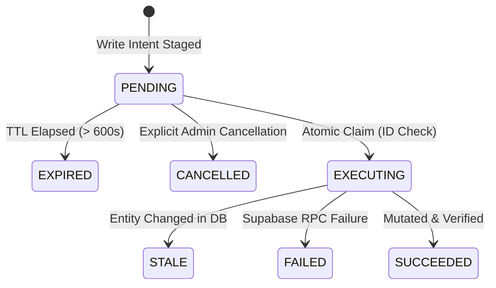

# Action Confirmation Engine (Phase 4)

## Overview

The Oslava Admin AI Chatbot uses a stateful, two-phase confirmation engine for all administrative mutations. AI models (e.g. Groq GPT-OSS 120B) are strictly forbidden from executing mutations directly on Supabase. Instead, model write tools only produce **Write Intents** that stage a **Pending Action Record**.

Execution only occurs after an authorized human administrator explicitly confirms the action through an authenticated HTTP endpoint (`POST /v1/chat/actions/:actionId/confirm`) or the interactive CLI command (`/confirm`).

---

## Action State Machine

Each action transitions through an audited lifecycle:

### Action Status Definitions

| Status | Meaning |
| :--- | :--- |
| `PENDING` | Action staged and waiting for administrator review and confirmation. |
| `EXECUTING` | Action atomically claimed by a confirmation request to prevent double execution. |
| `SUCCEEDED` | Mutation completed on Supabase and verified via read-after-write. |
| `FAILED` | Mutation threw an operational error. |
| `CANCELLED` | Explicitly cancelled by the administrator. |
| `EXPIRED` | Action was not confirmed within `ACTION_CONFIRMATION_TTL_SECONDS` (default: 600s). |
| `STALE` | Underlying entity version or state changed between proposal and confirmation; execution aborted. |

---

## Safety Guarantees

### 1. Model Tool Isolation
- Model tools are strictly `WRITE_INTENT` tools.
- `ActionExecutionService` is server-only and never registered in `ToolRegistry`.
- When a model calls a write tool, the tool loop **immediately halts**. The model is never invoked to hallucinate confirmation messages.

### 2. Mandatory Reason Rule
- Every mutation requires an explicit operational reason of at least 3 characters.
- If the administrator does not provide a reason in their chat prompt, the agent asks for the reason before calling any tool. The agent is strictly instructed never to fabricate generic reasons (e.g. "Admin request").

### 3. Single Pending Action Rule
- A chat session can hold at most **one** active pending action at any time.
- Proposing a second action while one is pending returns error `PENDING_ACTION_EXISTS` (409 Conflict).

### 4. Atomic Execution Claiming
- Concurrent duplicate clicks or network retries are neutralized via an atomic conditional state update:
  - In PostgreSQL: `UPDATE chat_pending_actions SET status = 'EXECUTING' WHERE id = $1 AND status = 'PENDING' RETURNING *;`
  - In-memory: atomic verification and assignment under single-thread event loop.
- Any competing request receives `ACTION_ALREADY_RESOLVED` (409 Conflict).

### 5. Stale-State Detection
- Prior to executing the mutation RPC, the entity's current state is fetched afresh from the database.
- If a worker's category has changed or an event's version has incremented since the proposal was created, the action is marked `STALE` and rejected with `ACTION_STALE` (409 Conflict).

### 6. Read-After-Write Verification
- Following RPC execution, the updated entity is re-fetched and inspected.
- If the verified state does not reflect the target state, the engine throws `ActionOutcomeUnknownError` without blind retries.

### 7. Natural Language Protection
- Natural language messages (e.g. "yes", "do it", "confirm") in the chat conversation **cannot** execute actions.
- The assistant informs the user to click the Confirm button or run `/confirm <actionId>`.
