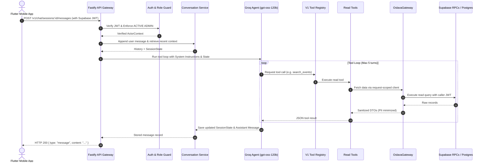
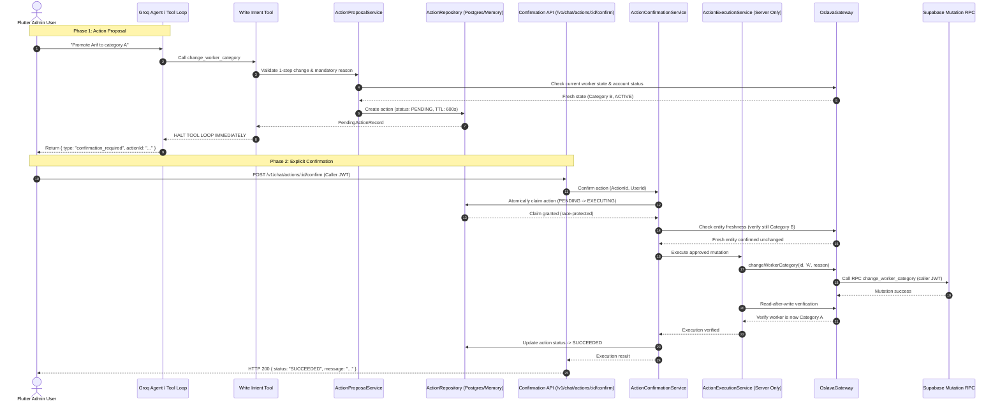

# Oslava Admin AI Chatbot — V1 Architecture Specification

This document details the architectural components, request flows, and separation of concerns for the V1 standalone chatbot backend.

---

## 1. End-to-End Conversational Read Query Flow



---

## 2. Safe Two-Phase Write & Confirmation Flow



---

## 3. Structural Component Hierarchy

```
Flutter App
   │ (Supabase JWT)
   ▼
Fastify API (/v1/...)
   │ (CORS, Helmet, RateLimiter, BodyLimit, ErrorMiddleware)
   ▼
Auth & Role Guard (Active Admin Check)
   │
   ├──────────────────────────────┬──────────────────────────────┐
   ▼                              ▼                              ▼
ConversationService       ActionProposalService       ActionConfirmationService
   │                              │                              │
   ▼                              ▼                              ▼
Groq Agent (gpt-oss-120b)     ActionRepository (PG/Mem)      ActionExecutionService
   │                                                             │ (Server Only)
   ▼                                                             ▼
V1 Tool Registry                                           OslavaGateway
   │                                                             │ (Caller JWT)
   ├──────────────────────────────┐                              ▼
   ▼                              ▼                      Supabase RPCs
7 Read Tools             4 Write Intent Tools
(get_dashboard,           (change_worker_category,
 search_events,            publish_event,
 get_event_details,        complete_event,
 search_workers,           close_event)
 get_worker_details,
 get_worker_history,
 get_event_report)
```

---

## 4. Frozen V1 Architectural Boundaries

- **Zero Direct Mutation from LLM**: No model tool has direct execution privileges on the database.
- **Dedicated Isolation**: `ActionExecutionService` is strictly imported and callable by `ActionConfirmationService`. It is not present in `ToolRegistry` and has no function calling schema.
- **Request-Scoped Gateway**: All database access executes with caller JWT propagation; no service-role secrets are used.
